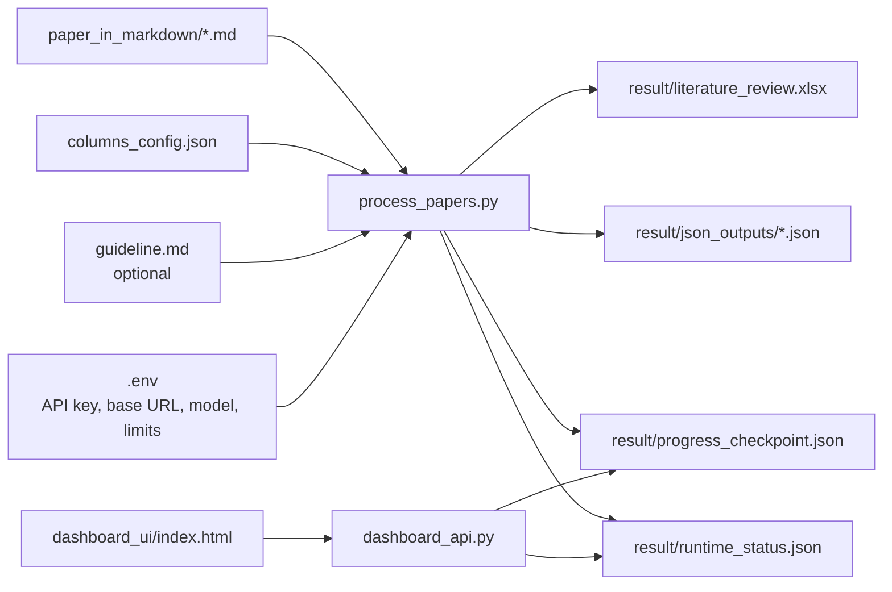

# Literature Review Extractor

Source: [github.com/raktim-mondol/lit-review-extractor](https://github.com/raktim-mondol/lit-review-extractor)

Scans markdown-format papers from `paper_in_markdown/`, sends each one to an **OpenAI-compatible** chat API, extracts structured fields defined in `columns_config.json`, and writes results to `result/`. Environment variable names use the `DASHSCOPE_*` prefix for historical reasons; you can point them at **OpenRouter**, **Dashscope**, or any other compatible base URL.

The default documentation assumes **OpenRouter** with MiniMax, e.g. `minimax/minimax-m2.5`.

---

## How it works



### Processing/output map

```
paper_in_markdown/*.md
        │
        ▼
 process_papers.py  ──reads──  columns_config.json  (what to extract)
        │           ──reads──  guideline.md          (system prompt, optional)
        │           ──reads──  .env                  (API key, base URL, model, optional limits)
        │
        ▼
 result/
 ├── literature_review.xlsx    ← one row per successful paper
 ├── json_outputs/             ← one JSON per successful extraction
 ├── progress_checkpoint.json   ← resume: completed / failed tracking
 ├── runtime_status.json        ← live state for the mission-control dashboard
 └── process_runtime.log        ← stdout when started from the dashboard API
```

---

## Setup

**1. Install dependencies**

```bash
pip install -r requirements.txt
```

**2. Configure `.env`**

Create a `.env` file in the project root (it is gitignored — never committed):

```env
DASHSCOPE_API_KEY=your_openrouter_key_here
DASHSCOPE_BASE_URL=https://openrouter.ai/api/v1
DASHSCOPE_MODEL=minimax/minimax-m2.5

# Optional: max characters of each .md sent to the model (avoids context-length errors on huge files)
MAX_PAPER_CHARS=180000
```


| Variable             | Required | Description |
| -------------------- | -------- | ----------- |
| `DASHSCOPE_API_KEY`  | yes      | API key for the provider at `DASHSCOPE_BASE_URL` (OpenRouter: key from [openrouter.ai](https://openrouter.ai/keys)) |
| `DASHSCOPE_BASE_URL` | yes      | Chat Completions base URL, e.g. `https://openrouter.ai/api/v1` or your vendor’s OpenAI-compatible endpoint |
| `DASHSCOPE_MODEL`    | yes      | Model id accepted by that API (OpenRouter: use the id shown on the model page, e.g. `minimax/minimax-m2.5`) |
| `MAX_PAPER_CHARS`  | no       | Truncate each paper to this many characters before the API call (default `180000`). Longer inputs can trigger context-window errors on some models. |

A template is in `.env.example` — copy to `.env` and adjust for your provider.

### OpenRouter (recommended for this repo)

Use the OpenRouter base URL and an OpenRouter model id:

```env
DASHSCOPE_BASE_URL=https://openrouter.ai/api/v1
DASHSCOPE_MODEL=minimax/minimax-m2.5
```

### Dashscope (Aliyun) or other vendors

Point `DASHSCOPE_BASE_URL` and `DASHSCOPE_MODEL` at that vendor’s OpenAI-compatible chat endpoint and model name.

### Optional multi-model rotation

`process_papers.py` supports alternating between a primary route and an `ALT_*` OpenRouter (or other) route via `ALT_DASHSCOPE_*` variables. If those are unset, a **single** model is used. See comments in `process_papers.py` for `ALT_DASHSCOPE_MODELS`, `ALT_EACH_MODEL_BATCH`, and `PRIMARY_NEXT_BATCH`.

**Example models (OpenRouter ids vary — check the provider’s catalog)**

| Example id / name        | Notes |
| ------------------------ | ----- |
| `minimax/minimax-m2.5`   | Typical default when using OpenRouter + MiniMax |
| `qwen3.5-plus` etc.      | Use the exact string your base URL expects (Dashscope vs OpenRouter differ) |
| Vision models            | Only relevant if you later extend the pipeline to send images |


**3. Add your papers**

Drop markdown files into `paper_in_markdown/`. Papers are processed in alphabetical order by filename.

**4. Run**

```bash
python process_papers.py
```

---

## Customising extracted columns

Edit `columns_config.json` — **no code changes needed**.

Each entry defines one Excel column:

```json
{
  "column_name": "Cancer Type",
  "field_key": "cancer_type",
  "description": "Cancer type(s) studied in the paper",
  "width": 20
}
```


| Field         | Required | Description                                                |
| ------------- | -------- | ---------------------------------------------------------- |
| `column_name` | yes      | Excel column header                                        |
| `field_key`   | yes      | JSON key the model returns — unique, snake_case, no spaces |
| `description` | yes      | Instruction sent to the model for this field               |
| `width`       | no       | Excel column width in characters (default: 25)             |


**To add a column** — append a new entry to the array.  
**To remove a column** — delete its entry.  
**To rename a column** — change `column_name`.  
**To change what the model extracts** — change `description`.

The four fixed columns `Serial No.`, `File Name`, `Status`, and `Error` are always present and cannot be removed via the config.

---

## Optional: custom system prompt

If a `guideline.md` file is present in the project root, its content is used as the system prompt sent to the model. If the file is absent, a built-in default prompt is used automatically.

---

## Resuming interrupted runs

Progress is saved to `result/progress_checkpoint.json` after every paper. If the script is stopped, re-running it will skip already completed papers.

To force reprocessing of specific papers by serial number:

```bash
python process_papers.py --force 2 5 7
```

Serial numbers are assigned in alphabetical order of filenames (1-based).

---

## File reference

```
project/
├── process_papers.py          # Main script
├── dashboard_api.py           # FastAPI status + run controls
├── dashboard_ui/              # No-build dashboard (serve with http.server)
├── dashboard-frontend/        # Optional Vite + React
├── columns_config.json        # Column definitions — edit this to customise output
├── requirements.txt           # Python dependencies
├── .env                       # API credentials — gitignored, never committed
├── guideline.md               # Optional custom system prompt
├── paper_in_markdown/         # Input: drop .md papers here
└── result/                    # Output: created automatically
    ├── literature_review.xlsx
    ├── json_outputs/
    ├── progress_checkpoint.json
    ├── runtime_status.json
    └── process_runtime.log    # when runs are started via dashboard API
```

---

## Notes

- Fields not found in a paper are written as `Not Reported (NR)`.
- Alternate row shading and frozen header row are applied automatically in the Excel output.
- The script retries failed API calls up to 3 times with a 10-second delay before logging the failure and moving on.
- Papers that failed previously are **not** skipped on the next run unless they appear in the completed checkpoint; only successful completions are skipped.

---

## Mission control dashboard (FastAPI + React UI)

A small dashboard shows live progress, ETA (after at least one file finishes in the run), active **provider** and **model**, and start/stop for `process_papers.py`.

### 1) Start the API server

From the project root:

```bash
pip install -r requirements.txt
uvicorn dashboard_api:app --reload --host 127.0.0.1 --port 8000
```

### 2) Serve the UI (recommended)

The UI in `dashboard_ui/index.html` is easiest to use when served on the same host as you use for the API (avoids browser issues with `file://`):

```bash
cd dashboard_ui
python -m http.server 5173
```

Open [http://127.0.0.1:5173](http://127.0.0.1:5173).

### Dashboard features

- Totals, progress bar, **ETA** and average time per file (when available)
- Current file, route, provider, model, API attempt
- Pending-file preview and recent JSON outputs
- **Start Process** / **Stop Process** (runs `process_papers.py` in the background; logs append to `result/process_runtime.log`)

After changing `.env`, use **Stop** then **Start** in the dashboard so a new run reloads environment variables.

---

## Package and publish with uv

This project includes `pyproject.toml` and can be built/published with [uv](https://docs.astral.sh/uv/).

### Install locally with uv

```bash
uv sync
uv run lit-review-extractor
```

Run the dashboard API as an installed console script:

```bash
uv run lit-review-dashboard-api
```

### Build artifacts

```bash
uv build
```

This creates source/wheel artifacts in `dist/`.

### Publish to PyPI (package distribution)

Set your PyPI token once:

```bash
set UV_PUBLISH_TOKEN=pypi-xxxxxxxxxxxxxxxx
```

Then publish:

```bash
uv publish
```

### GitHub release tag for this version

```bash
git tag v1.0.1
git push origin v1.0.1
gh release create v1.0.1 --title "v1.0.1" --notes "Initial packaged release with dashboard and resume/ETA improvements."
```

